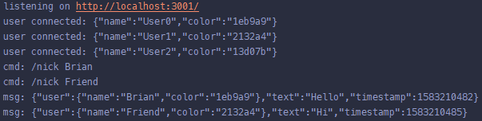

Course: SENG 513

Project: Chat App

Authors: Brian Pho

Year: 2020

---

## React and Socket.io Chat App

This is a simple, real-time chat application built using [React](https://reactjs.org/), 
[React Bootstrap](https://react-bootstrap.github.io/), [socket.io](https://socket.io/), 
[Express](https://expressjs.com/) and [node.js](https://nodejs.org/en/). 
This repository is divided into two folders, one for the client-side
code and one for the server-side code.

### Steps to Run

#### Client

1. `cd client`
2. `npm ci` (only for the first time to install dependencies)
3. `npm start`

#### Server

1. `cd server`
2. `npm ci` (only for the first time to install dependencies)
3. `npm start`

Run `npm run watch` if you're modifying the server and want the server to restart upon changes.

### Screenshots

#### Client

#### Server

